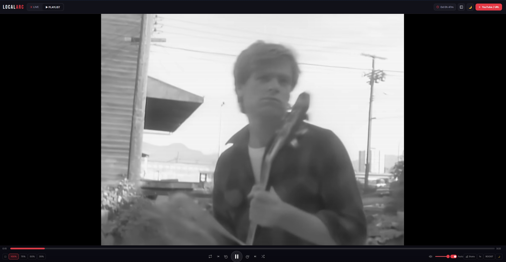
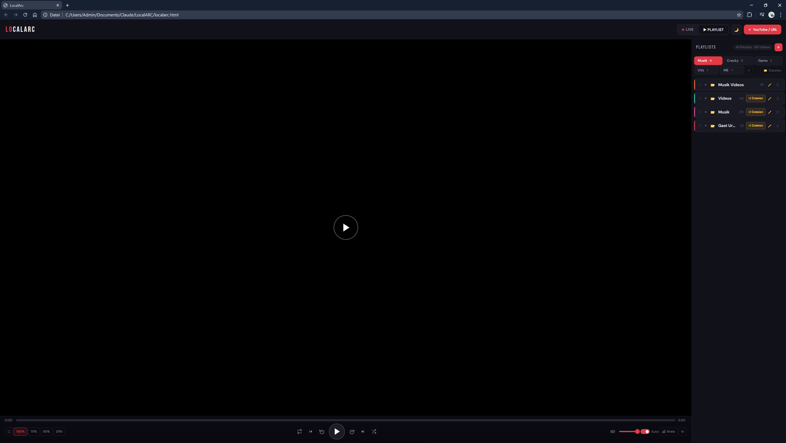

  

<h1 align="center">LocalArc</h1>

  <strong>A blazing-fast, fully offline media player — in a single HTML file.</strong> 
  No server. No install. No tracking. Just open and play.

  

  
  
  
  

---

## What is LocalArc?

LocalArc is a **complete media center** packed into a single `localarc.html` file. Drop in your local videos, audio files, or YouTube links — and you have a beautiful, fully-featured player with playlists, live streams, and more. Everything runs **100% in your browser**, nothing is uploaded anywhere.

> **[Try the Live Demo](https://philippweidlich.github.io/LocalArc/localarc.html)**

---

## Screenshots

| Playlist View | Video Playing |
|:---:|:---:|
|  |  |

---

## Features

### Player
- **Local video & audio playback** — drag & drop MP4, MKV, WebM, MP3, FLAC, WAV, OGG, M4A, AAC, OPUS and more
- **YouTube embed support** — paste YouTube links directly into playlists
- **URL video streams** — play any direct video/audio URL
- **Playback speed control** — 0.25x to 2x with quick-access panel
- **15-second skip** — click zones on the left/right side of the video or use keyboard shortcuts
- **Resume playback** — remembers where you left off for every video
- **Video size modes** — 100%, 75%, 50%, 25% scaling
- **Fullscreen mode** — with auto-hiding controls
- **Center play/pause overlay** — large, clickable play button on the video
- **Volume control** — slider + mute toggle
- **Autoplay** — automatically plays the next item in the playlist
- **Shuffle & Repeat** — randomize playback or loop the playlist
- **Video statistics** — real-time stats overlay (resolution, codec, bitrate, etc.)
- **Progress bar with preview** — hover to see timestamp before seeking
- **Scrubbing** — smooth drag-to-seek with mouse and touch support

### Playlists
- **Multiple playlists** — create, rename, delete, and color-code playlists
- **Playlist tabs** — up to 8 tabs (PL1–PL8) to organize playlists into groups
- **Drag & drop reordering** — move videos within a playlist by dragging
- **Drag & drop between tabs** — drag playlist sections onto different tabs to reorganize
- **Playlist search** — filter videos and playlists by name
- **Thumbnail generation** — automatic thumbnails for local videos
- **Album art extraction** — displays embedded cover art for audio files
- **File type badges** — MP4, MP3, YT, URL — clearly labeled per item
- **Resume progress bars** — see how far you've watched each video at a glance
- **Bulk YouTube/URL import** — paste multiple links at once
- **Relink offline files** — re-attach local files after browser restart
- **Collapsible sections** — collapse/expand playlists to save space

### Live Streams
- **Live source manager** — add, edit, and delete live stream sources
- **Embed/iframe support** — works with any embeddable stream URL
- **Custom tags & colors** — label and color-code your sources (HD, Sport, News, etc.)
- **Quick switch** — press 1–9 to jump between live sources instantly
- **Search sources** — filter your live streams by name

### UI & Design
- **Dark & Light mode** — toggle with one click, preference is saved
- **Responsive layout** — works on desktop and mobile
- **Toast notifications** — elegant feedback for every action
- **Keyboard shortcuts overlay** — press `?` to see all shortcuts
- **Smooth animations** — transitions, hover effects, and micro-interactions
- **Scanline overlay** — subtle retro CRT effect on the player
- **Modern design** — clean, minimal interface with Bebas Neue & DM Sans typography

### Keyboard Shortcuts

| Shortcut | Action |
|---|---|
| `Space` | Play / Pause |
| `Arrow Right` | Next video |
| `Arrow Left` | Previous video |
| `Shift + Arrow Right` | Skip +15 seconds |
| `Shift + Arrow Left` | Skip -15 seconds |
| `Shift + Arrow Up` | Speed up |
| `Shift + Arrow Down` | Speed down |
| `F` | Toggle fullscreen |
| `M` | Toggle mute |
| `?` | Show shortcuts overlay |
| `1`–`9` | Select live source (in Live mode) |
| `Escape` | Close modals / overlays |

### Technical
- **Single HTML file** — no build step, no bundling, no dependencies
- **135 KB total** — incredibly lightweight
- **100% client-side** — all data stays in your browser (localStorage)
- **Zero dependencies** — no frameworks, no libraries, pure vanilla JS + CSS
- **Touch-friendly** — full touch support for mobile devices
- **Persistent state** — playlists, themes, volume, resume positions — all saved locally

---

## Getting Started

1. **Download** `localarc.html`
2. **Open** it in your browser (Chrome, Firefox, Edge, etc.)
3. **Done.** Start adding videos!

That's it. No install. No server. No config.

Or just **[try the live demo](https://philippweidlich.github.io/LocalArc/localarc.html)** right in your browser.

---

## About This Project

This is a personal side project. I'm an apprentice IT specialist (Fachinformatiker Systemintegration) and developed this iteratively with the help of AI coding assistants (Claude). The architecture, feature decisions, design direction, and testing were all driven by me; the AI helped me write and refine the code faster than I could have alone. I'm sharing this openly because I believe in transparent AI-assisted development — the result is real, it works, and it's yours to use, fork, and improve.

---

## License

This project is licensed under the [MIT License](LICENSE) — free to use, modify, and distribute.

---

  Made with weeks of dedication and attention to detail.

